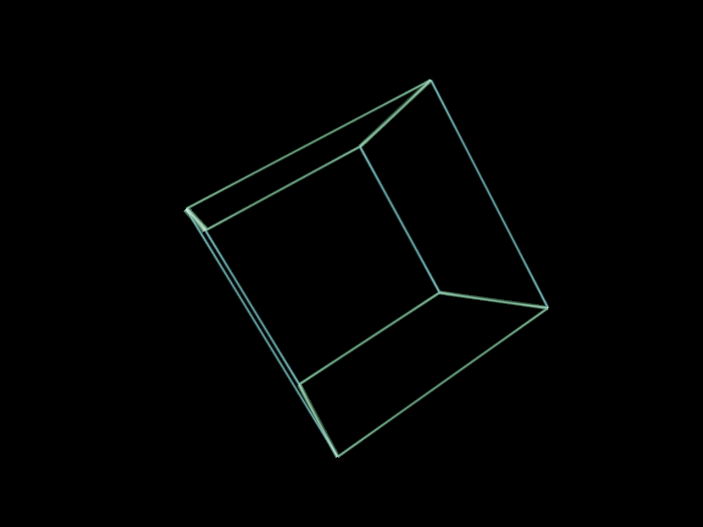
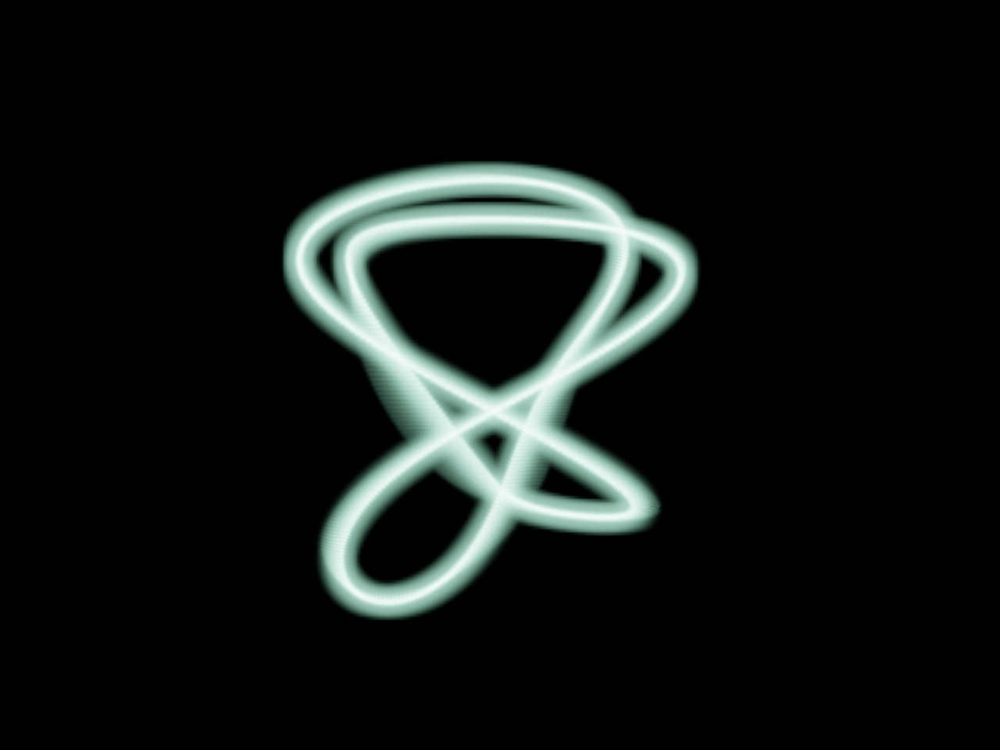

# vector-beam

A tiny **vector-display / "electron beam" line renderer** in [wgpu](https://wgpu.rs/).
3D line segments are expanded into screen-space ribbons and drawn with a Gaussian
beam cross-section into an HDR target, so they glow like phosphor strokes on an
old oscilloscope or vector arcade monitor.



## Run it

```sh
cargo run --release
```

A window opens showing a slowly tumbling wireframe cube drawn as glowing beams,
leaving fading phosphor trails as it turns.
Needs a GPU with a Vulkan / Metal / DX12 / GL backend (anything wgpu supports).

The trail length is tunable with `--persistence <seconds>` (the phosphor decay
time constant); `--persistence 0` disables trails entirely. The default depends
on the mode: 3 ms in scan mode (below), 100 ms with `--no-scan`.

### Beam scan mode

By default the renderer behaves like an actual vector display rather than a
framebuffer: the hardware loop presents at the panel rate (say 240 Hz) while
the scene refreshes at a logical *scan rate* (60 Hz default), and each hardware
frame draws only the slice of the stroke list the beam would have covered in
that ~4 ms window. Stroke list order is the beam path order; the scheduler
([`src/scan.rs`](src/scan.rs)) slices it by cumulative arc length, and phosphor
decay fills the time between slices. On a high-refresh panel this gives
CRT-like motion clarity and an unusually short input-to-photon path.

- `--scan-hz <hz>` — logical scan rate (default 60; 120 halves the flicker at
  the cost of half the clarity benefit).
- `--hw-hz <hz>` — override the detected monitor refresh rate.
- `--beams <B>` — simulate B simultaneous beams: the stroke list is split into
  B arcs and each subframe draws one bucket from every arc.
- `--beam-gain <x>` — brightness compensation; each stroke is lit only 1/N of
  the scan cycle, so intensity defaults to N× (capped at 16).
- `--no-scan` — start in the legacy draw-everything-every-frame mode. The
  `S` key toggles scan mode live (the persistence default follows the mode).
- `--present-mode immediate|mailbox|fifo` — swapchain present mode; by default
  the lowest-latency supported mode is chosen (Immediate → Mailbox → Fifo).
- `--fullscreen` — borderless fullscreen, required for direct scanout; a
  window always eats a compositor copy.

The frame loop holds at most one frame of queued latency, and a 5-second
telemetry line reports input-to-submit percentiles plus GPU frame time (via
timestamp queries, where supported). For a clean scan cadence, disable
adaptive sync (VRR) on the panel — re-timed scanout jitters the subframe
windows.

### Scenes

`--scene <name>` picks the demo scene:

- `cube` (default) — the tumbling wireframe cube above.
- `ship` — an Asteroids-style ship: arrows or WASD to turn and thrust, momentum
  and screen wrap included. Closed-loop steering is the canonical way to *feel*
  the latency work, which a self-animating scene can't show.
- `ufo` — a saucer scrolling steadily across the screen (a UFO-test-style
  motion-clarity pattern): track it with your eyes and toggle scan mode with
  `S`; the difference in edge clarity is unambiguous.
- `lissajous` — a dense 3D Lissajous curve whose phase drifts over time, so the
  figure continuously morphs like a slowly de-tuning oscilloscope:

```sh
cargo run --release -- --scene lissajous
```



### Regenerate the screenshot

The same renderer can capture a single frame to a PNG headlessly (no window),
which is how `docs/screenshot.png` is produced:

```sh
cargo run --release -- --screenshot docs/screenshot.png 1280x960
```

## How it works

The interesting part is the shader, [`shaders/beam.wgsl`](shaders/beam.wgsl).

- **Instanced wide-line expansion.** Each line segment is one *instance*; the
  vertex shader synthesizes a 6-vertex quad from `@builtin(vertex_index)` (no
  vertex buffer) and offsets the two endpoints perpendicular to the segment in
  *screen space*. The offset is pre-multiplied by `clip.w`
  (`clip.xy + offset_ndc * clip.w`) so it survives the GPU's perspective divide
  and the line keeps a **constant pixel width** at any depth.
- **Gaussian beam profile.** The fragment shader shapes the cross-section as a
  tight bright core (`exp(-d²·7)`) plus a wide soft glow, and brightens the
  endpoints slightly so stroke junctions read as brighter dots — the way a real
  beam dwells where it changes direction.
- **Beam-speed model.** A segment that covers more screen distance is treated as
  being "drawn faster," so it comes out **dimmer and thinner**; short segments
  dwell and come out **bright and thick**. As the cube spins, edges sweeping
  quickly across the screen visibly dim — that is this model at work.
- **HDR + additive blending.** The beam pass renders into an `Rgba16Float`
  target with additive blending so overlapping strokes *accumulate* light, then
  a fullscreen [`shaders/tonemap.wgsl`](shaders/tonemap.wgsl) pass applies
  exposure + Reinhard tonemapping and resolves to the sRGB swapchain.
- **Bloom.** The hottest parts of the image bleed a wide halo, like a bright
  trace blooming on CRT glass. [`shaders/bloom.wgsl`](shaders/bloom.wgsl) runs
  three quarter-resolution passes (host side in [`src/bloom.rs`](src/bloom.rs)):
  a bright-pass downsample with a soft threshold knee (only HDR values above
  ~1.0 bloom — fresh cores and dwell-hot spots, not the faded trails), then a
  separable 9-tap Gaussian blur. The tonemap pass adds the result back, with
  the bilinear sampler upsampling the quarter-res halo for free.
- **Phosphor persistence.** The HDR target is never cleared; instead, each frame
  starts by fading it with a fullscreen [`shaders/decay.wgsl`](shaders/decay.wgsl)
  draw before the new beams are added on top, so strokes linger and fade like
  excited phosphor. The fade needs no extra textures or shader reads — the
  pipeline blends with `(src: Zero, dst: Constant)`, computing
  `dst * blend_constant` in fixed-function hardware, and the host loads
  `exp(-dt / persistence)` into the blend constant each frame so the decay is
  framerate-independent.

The host code in [`src/main.rs`](src/main.rs) is a minimal winit + wgpu setup;
the scenes live in [`src/geometry.rs`](src/geometry.rs) behind a `Scene` enum.
A scene owns its segments and its model matrix: the cube is rigid (all motion
is in the matrix; its vertex buffer uploads once), while the Lissajous morphs,
so its segments are regenerated and re-uploaded every frame.

## Implementation notes

- **Near-plane clipping is handled.** A segment with an endpoint at or behind the
  camera plane (`w <= 0`) is clipped against `w = ε` *in clip space, before* the
  perspective divide, by interpolating the crossing point; segments fully behind
  the camera are culled. Without this, a segment crossing the near plane would
  explode into garbage geometry. (Resolved [#1](../../issues/1).)
- **Energy-normalized dwell.** The beam-speed model makes slow beams thicker, but
  intensity is divided by the width factor so a thicker beam *spreads* its energy
  across the wider line rather than also multiplying peak brightness — otherwise
  short/slow segments over-blow on the HDR target (`intensity ∝ dwell / width`).
- **Screenshots replay history.** A persistence trail is, by definition, light
  from *previous* frames, so a one-shot headless render would show none. The
  screenshot path instead simulates the preceding ~5 time constants of frames at
  60 Hz into the persistent HDR target and captures the last one.

## License

[CC BY-NC 4.0](LICENSE) (Creative Commons Attribution-NonCommercial 4.0
International) — share and adapt with attribution, non-commercial use only.
